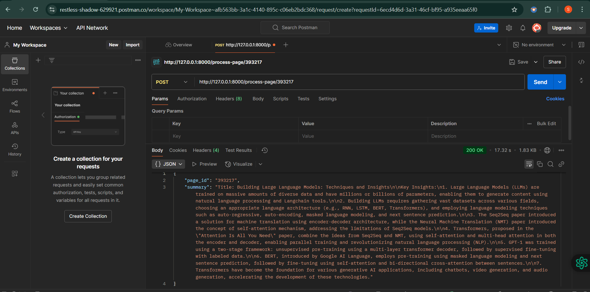
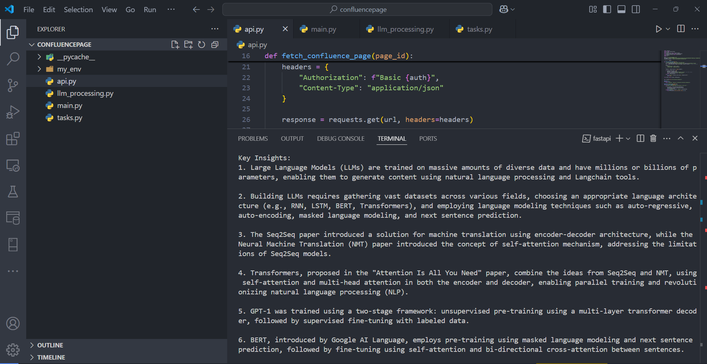

# ConfluencePage
1️. User/Admin Triggers API Request
The user/admin interacts with the system via a frontend (e.g., Streamlit UI, CLI, or Postman).
They provide a Confluence Page ID and request summarization or insights.
The request is sent to the FastAPI backend.

2. FastAPI Backend Receives the Request
The FastAPI backend receives the request and validates it.
It checks if the Page ID is valid.
Then, it decides the next step:
If the summary already exists in the database, it retrieves and returns it.
If the summary is not available, it fetches the Confluence page content.

3. Fetch Confluence Page Content
The FastAPI backend makes an HTTP request to the Confluence API (Atlassian).
It retrieves the HTML content of the requested page.

4. LLM Processing with LangChain + GPT-4
The cleaned text is passed to LangChain, which integrates GPT-4 for:
Summarization
Key Insights Extraction
Actionable Recommendations
This step transforms unstructured page content into structured summaries and insights.

5.Return Processed Insights to the User
The summarized data is sent back to the user/admin.
If the request was made from Streamlit, it displays the response in the UI.
If the request was made from an API client (e.g., Postman, CLI), it returns a JSON response.

